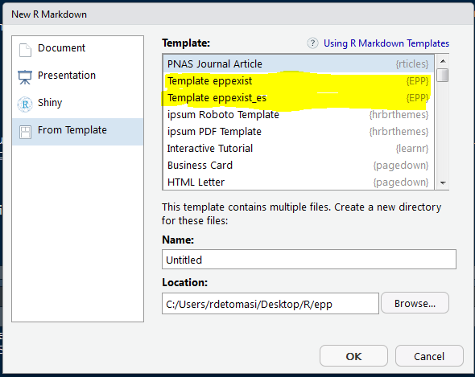

# EPP

<!-- badges: start -->
  [](https://doi.org/10.5281/zenodo.5138170)
  [](https://github.com/RichDeto/EPP/actions)
  [{target='_blank'}](https://codecov.io/gh/RichDeto/EPP)
  [](https://www.repostatus.org/#active)
<!-- badges: end -->

## Evaluation of Proximity Programs

**EPP** is a library oriented to cases of evaluation for an initial education program in Uruguay,
which gave us interesting results, and we wanted to share the methodology used, in a R package format. 
All contributions are welcome, even though we are still in the process of improvement.

## Installation

```R
# Use the development version with latest features
  utils::remove.packages('EPP')
  devtools::install_github("RichDeto/EPP")
  library(EPP)
```

## Basic Usage

### Main functions

A first instance is to estimate the population covered with the existing infrastructure, and therefore we refer to the `eppexist()` function. An important detail to take into account is that our centers cannot overlap, since this prevents the correct computation of the Voronoi polygons. For this particular case, the `group_over()` function was implemented that combines the records for this specific application case. 

Using the datasets `pop_epp` and `centers_epp` of the own library, this is it use. 

```R
centers_epp <- group_over(rbind(centers_epp, centers_epp[ 1:3,]))
exist <- eppexist(pop = pop_epp, centers = centers_epp, crs = sp::CRS("+init=epsg:32721"))
```

Normally the population is not covered at all, and that's when `eppproy()` appears, a function to propose where it may be optimal to create new centers to cover the remaining population.  

Continuing with the example:

```R
proy <- eppproy(pop = exist$pop_uncover)
```

But this was just an example using the default values of all the parameters. Then play around with them and report any bug [here](https://github.com/RichDeto/EPP/issues/new/choose).

### Report template

The library also has templates in English and Spanish to quickly have a report of the results of the processing.
In RStudio when you create a new RMarkdown document you can select the template like image show and start to personalizate it. 



### General functions

The syntax of all `{EPP}` functions are focused on executing two main processes,`eppexist()` and `eppproy()`, both aimed at evaluating the distribution of a certain population and the centers planned to cover it. But undercover we have left some tools that can be useful for other processes. Among them, we can mention those that allow making voronoy polygons (`voro_polygon()`), buffer-voronoy (`buff_voronoi()`) and iterative clusters (`clust_it()`).

## References

Detomasi, R. 2018. "Abordaje espacial de políticas públicas: cuidados y primera infancia”. En: [Las políticas públicas dirigidas a la infancia en Uruguay](https://www.google.com/url?sa=t&rct=j&q=&esrc=s&source=web&cd=2&cad=rja&uact=8&ved=2ahUKEwiu_uH64vHjAhXsJ7kGHRHOCo4QFjABegQIABAC&url=https%3A%2F%2Frepositorio.cepal.org%2Fbitstream%2Fhandle%2F11362%2F44155%2F1%2FS1800463_es.pdf&usg=AOvVaw3EPJkSZSWIDsQ-dpwcHuUO). Coords. Verónica Amarante  y Juan Pablo Labat. Ed. CEPAL - UNICEF, Santiago de Chile.

Detomasi, R., G. Mathieu y G. Botto 2018. ["EPP v.0.2: Evaluation of Proximity Programs with OSRM routing"](http://47jaiio.sadio.org.ar/sites/default/files/LatinR_10.pdf). LatinR - Conferencia Latinoamericana sobre Uso de R en Investigación + Desarrollo. 3 al 7 de Setiembre. 

Detomasi, R. y G. Botto. 2017. ["Evaluación espacial de servicios de educación inicial: la densificación de la oferta para tres años en la Administración Nacional de Educación Pública (ANEP)"](http://www.geofocus.org/index.php/geofocus/article/view/508). GeoFocus (ISSN 1578-5157).

Botto, G. y Detomasi, R. 2015. ["Bases metodológicas para la planificación espacial de servicios de educación inicial en Uruguay"](http://dinem.mides.gub.uy/innovaportal/file/61794/1/tecnologias-de-la-informacion-para-nuevas-formas-de-gestion-del-territorio.-2015.pdf) Jornadas Argentinas de Geo-tecnologías: Trabajos completos. Universidad Nacional de Luján - Sociedad de Especialistas Latinoamericanos en Percepción Remota - Universidad Nacional de San Luis, pp. 121-128.

Detomasi, R., Botto, G. y Hahn, M. 2015. ["CAIF: Análisis de demanda"](http://dinem.mides.gub.uy/innovaportal/file/61792/1/caif.-analisis-de-demanda.-2015.pdf) Documento de trabajo, Mayo 2015. Departamento de Geografía. Dirección Nacional de Evaluación y Monitoreo. Ministerio de Desarrollo Social.  

R Development Core Team 2015. ["R: A language and environment for statistical computing"](http://www.R-project.org/) R Foundation forStatistical Computing, Vienna, Austria.ISBN 3-900051-07-0.
